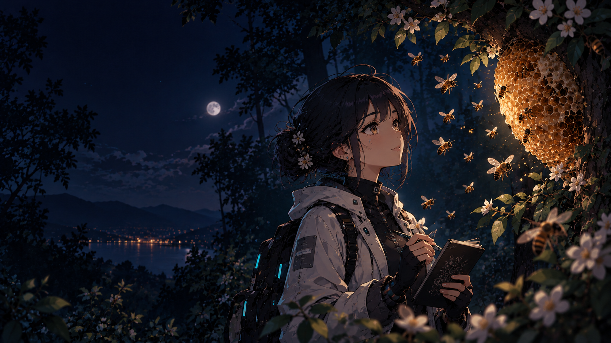

  

<h1 align="center">Andrés Peña Mellado</h1>

  <b>Principal researcher of LUS (Lore User System) · Founder · Builder</b> 
  <i>Experience only creates value when it can take part in a future decision.</i>

  
  
  
  

---

### About

Building in Web3 — General Editor of the community journalism pilot at **Tellus Cooperative**. Previously on the editorial teams of **Polkadot Español** and **BeInCrypto**.

Teaching & research: part of the team that laid the bibliographic and methodological foundations for **Design Thinking** at UTEM's School of Computer Engineering (2023), and lecturer from 2023 to 2025. **Speaker at [KCD El Salvador 2023](https://www.credly.com/badges/ad17002a-16be-474b-ada4-d7ba0df3a0fd)**.

My current focus is **LUS** — a research program on how shared human–AI experience can become criterion that participates in future decisions — and its technical arm, **Lore Plugin**: *local fine-tuning for your own tasks, and the one doing the training is you.*

> **Gardener of the Between:** I keep what deserves to orient another decision and prune what no longer constrains anything. Poet when code sleeps.

---

### What I'm building

| Project | What it is | Where to find it |
|---|---|---|
| **LUS** | Research program on the Between, criterion and distillation | [`docs/LUS_en.md`](https://github.com/andresanemic/lore-plugin/blob/main/docs/LUS_en.md) · [Public NotebookLM](https://notebooklm.google.com/notebook/6191db3f-3f9b-4412-b792-86a081b79450) |
| **Lore Plugin** | Provider-neutral SDD kit — 7 skills, 6 pieces, human threshold | [`andresanemic/lore-plugin`](https://github.com/andresanemic/lore-plugin) |
| **Vespi** | Distinct bodies, bounded authority — operations that return time, not throughput | [`andresanemic/vespi`](https://github.com/andresanemic/vespi) |
| **Tellus Cooperative** | General Editor — community journalism pilot (Sept 2026) | [`Tellus-Cooperative`](https://github.com/Tellus-Cooperative) · [blog](https://blog.telluscoop.com/) |
| **Poems** | Personal portfolio — code by day, poetry by night | [`andresanemic/andresanemic`](https://github.com/andresanemic/andresanemic) |

---

### Stack & obsessions

`criterion > information` · `distillation > documentation` · `threshold > automation` · `Between > prompt`

Interests: Spec-Driven Development, criterion preservation, Design Thinking, crypto journalism, communities, poetry.

---

### Connect

  
  
  
  
  
  

---

  <i>If a sentence doesn't constrain a future decision, it's not Lore.</i> 
  <a href="https://github.com/andresanemic/lore-plugin">Lore Plugin</a> · <a href="https://github.com/andresanemic/lore-plugin/blob/main/docs/LUS_en.md">Research boundary</a>

